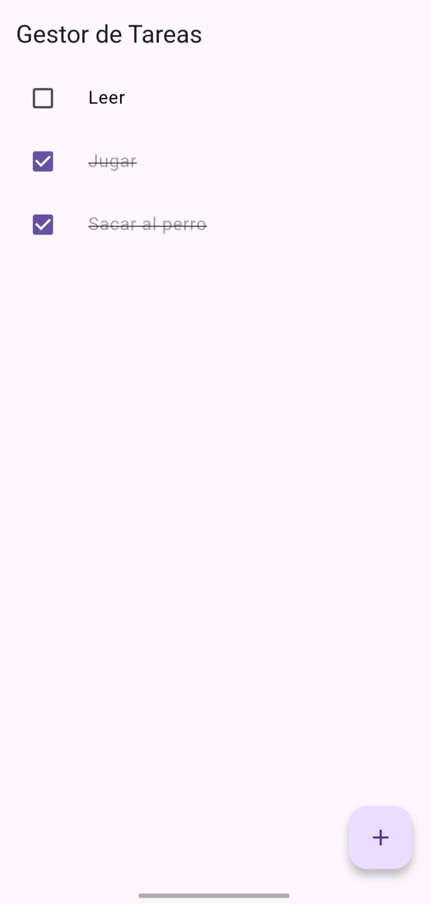
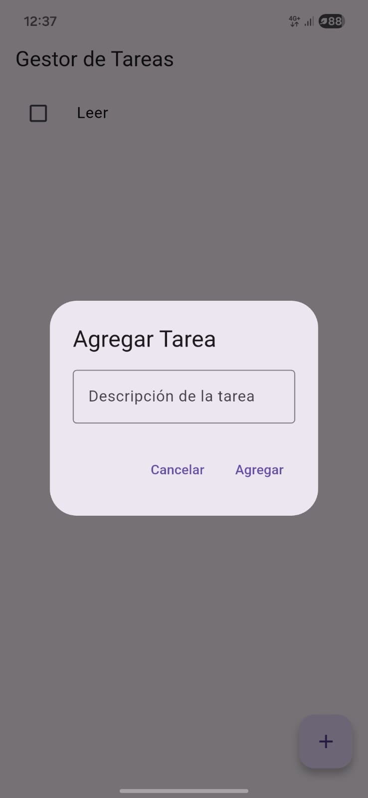
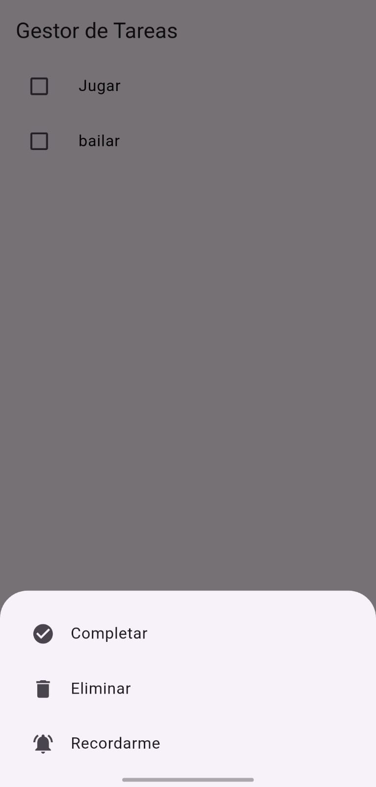
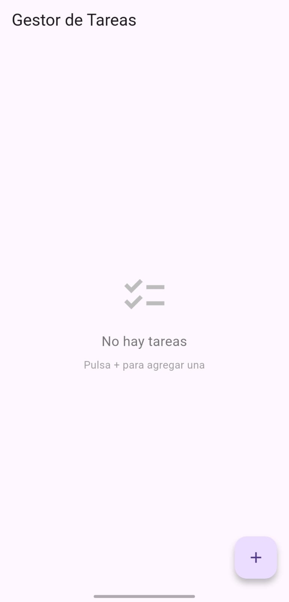
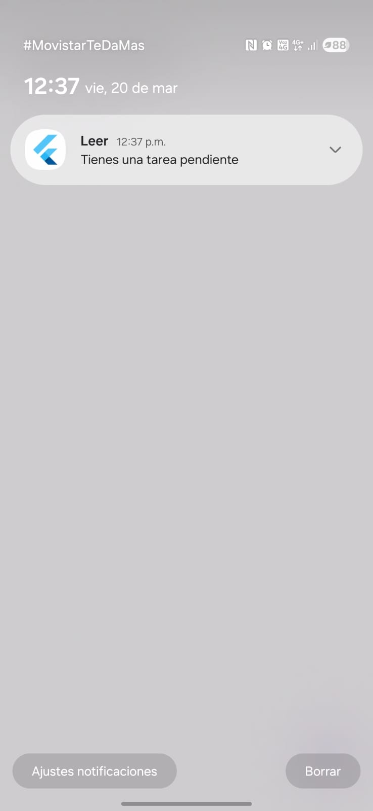

# 📝 Gestor de Tareas

Una aplicación móvil desarrollada con **Flutter** que permite gestionar tareas de manera eficiente con soporte para notificaciones locales y persistencia de datos.

## ✨ Características

- ✅ **Lista de tareas** - Visualiza todas tus tareas con estado (pendiente/completada)
- ✅ **Agregar tareas** - Crea nuevas tareas mediante un diálogo intuitivo
- ✅ **Marcar como completada** - Marca tareas como finalizadas con un checkbox
- ✅ **Eliminar tareas** - Borra tareas con opción de deshacer
- ✅ **Notificaciones locales** - Recibe notificaciones al crear tareas
- ✅ **Recordatorios** - Programa recordatorios para tareas importantes (1 minuto de espera)
- ✅ **Opciones avanzadas** - Long press en tareas para acceder a más opciones
- ✅ **Persistencia de datos** - Las tareas se guardan automáticamente en el dispositivo
- ✅ **Material Design 3** - Interfaz moderna y responsiva

## 🚀 Requisitos Previos

Antes de instalar, asegúrate de tener lo siguiente:

- **Flutter SDK** (versión 3.9.2 o superior)
- **Dart SDK** (incluido con Flutter)
- **Android Studio** o **Visual Studio Code** con extensión de Flutter
- **Emulador de Android** o dispositivo físico conectado
- **Git** (opcional, para clonar repositorios)

### Verificar instalación

```bash
flutter --version
dart --version
flutter doctor
```

## 📦 Instalación

### 1. Clonar o descargar el proyecto

```bash
git clone <url-del-repositorio>
cd gestor_tareas
```

### 2. Obtener dependencias

```bash
flutter pub get
```

### 3. Conectar un dispositivo

**Emulador:**
```bash
flutter emulators --launch <nombre-emulador>
```

**Dispositivo físico:**
```bash
flutter devices
```

### 4. Ejecutar la aplicación

```bash
flutter run
```

O en modo release:

```bash
flutter run --release
```

## 🔧 Compilar APK

Para generar un archivo APK listo para instalar:

```bash
flutter clean
flutter pub get
flutter build apk --release
```

El APK se encontrará en: `build/app/outputs/flutter-apk/app-release.apk`

**Instalar en dispositivo:**
```bash
flutter install
```

## 📱 Uso de la Aplicación

### Agregar una tarea
1. Presiona el botón **+** flotante
2. Escribe la descripción de la tarea
3. Presiona **"Agregar"**
4. Recibirás una notificación confirmando la creación

### Marcar como completada
- Presiona el **checkbox** junto a la tarea
- La tarea se marcará con tachado

### Ver opciones avanzadas
- Presiona **largo** (long press) en cualquier tarea
- Se abrirá un menú con opciones:
  - **Completar** - Marca/desmarca la tarea como completada
  - **Eliminar** - Borra la tarea (con opción de deshacer)
  - **Recordarme** - Programa una notificación para 1 minuto después

### Deshacer acciones
- Al eliminar una tarea, presiona **"Deshacer"** en la notificación inferior

## � Capturas de Pantalla

### Lista de Tareas

Pantalla principal con la lista de tareas pendientes e interfaz para agregar nuevas tareas.

### Diálogo Agregar Tarea

Diálogo emergente para ingresar el nombre de la nueva tarea.

### Menú de Opciones (Long Press)

Menú inferior con opciones para completar, eliminar o recordar una tarea.

### Estado Vacío

Pantalla cuando no hay tareas pendientes.

### Notificación Local

Notificación que aparece al crear una tarea o cuando se activa un recordatorio.

## �🛠️ Tecnologías Utilizadas

| Tecnología | Versión | Descripción |
|-----------|---------|-------------|
| Flutter | 3.9.2+ | Framework de desarrollo móvil |
| Dart | 3.9.2+ | Lenguaje de programación |
| flutter_local_notifications | 17.1.0 | Notificaciones locales |
| shared_preferences | 2.2.0 | Almacenamiento local de datos |
| permission_handler | 12.0.1 | Gestión de permisos del sistema |
| timezone | 0.9.2 | Manejo de zonas horarias |
| Material Design 3 | - | Diseño visual moderno |

## 📂 Estructura del Proyecto

```
gestor_tareas/
├── lib/
│   └── main.dart              # Archivo principal con toda la lógica
├── android/                   # Configuración Android
├── ios/                       # Configuración iOS
├── pubspec.yaml              # Dependencias del proyecto
├── analysis_options.yaml     # Linting configuration
└── README.md                 # Este archivo
```

## 🔐 Permisos Necesarios

La aplicación requiere los siguientes permisos en Android:

- `POST_NOTIFICATIONS` - Para mostrar notificaciones (Android 13+)
- `SCHEDULE_EXACT_ALARM` - Para programar alarmas exactas
- `USE_EXACT_ALARM` - Para usar alarmas exactas

Estos permisos se solicitan automáticamente al iniciar la app.

## 🐛 Solución de Problemas

### Las notificaciones no llegan
- Verifica que hayas permitido notificaciones en la configuración del dispositivo
- Asegúrate de que la app tenga permisos de notificaciones
- En Android 13+, otorga el permiso explícitamente

### Las tareas no se guardan
- Verifica que haya espacio disponible en el dispositivo
- Borra la caché: `flutter clean`
- Reinstala: `flutter pub get && flutter run`

### Error al compilar
```bash
flutter clean
flutter pub get
flutter pub upgrade
```

## 📝 Licencia

Este proyecto es de código abierto y está disponible bajo la licencia MIT.

## 👨‍💻 Autor

Desarrollado como proyecto de demostración con Flutter y Dart.

## 📞 Soporte

Para reportar bugs o sugerir mejoras, abre un issue en el repositorio.

---

**¡Disfruta organizando tus tareas! 🎯**
